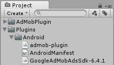
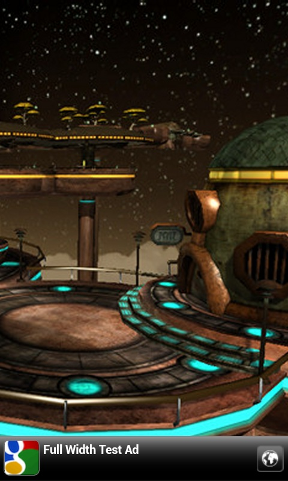
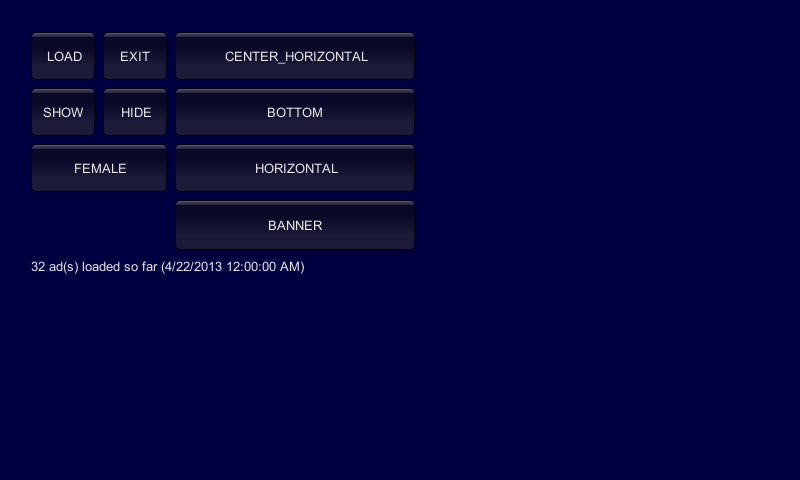
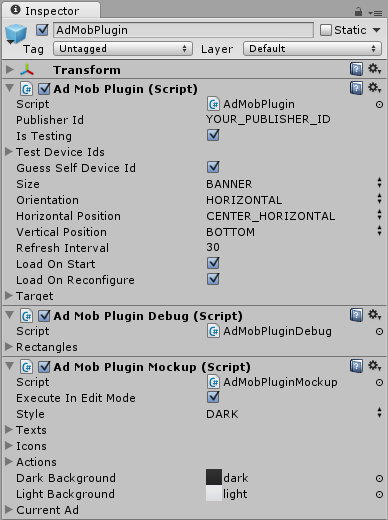
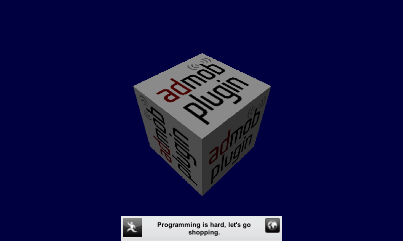

# AdMobPlugin Manual #

> Monetize your Unity games from today!

## Overview ##

**AdMobPlugin** is an extension for **[Unity3d](http://unity3d.com/)** which allows you to place **[Google AdMob](http://www.admob.com/)** banners in your **[Android](http://www.android.com/)** games.

You can choose size and position, refresh interval and switch on the test mode while you are developing your game. Location and demographic information may also be specified (if that information is already used by your game) to better target ads.

## Requirements ##

Please read this document in order to understand how this extension works and how you can integrate it into your own games. You must also understand the terms of the [license](#license) this plugin is released under.

**AdMobPlugin** connects to native libraries which control the banners. This libraries must be kept under `Plugins/Android` along with your assets.

In addition, a default *Android Manifest* is provided. You might need to modify it to ensure your game is configured properly.

You should [test](#test-mode) thoroughly on multiple platforms before releasing your game.

## Usage ##

You just need to add the `AdMobPlugin` component to some game object on your scene (or simply drag & drop the *AdMobPlugin prefab*). Remember to specify your own *publisher id* and off you go!

You can set most of the options from the editor. Click your *AdMobPlugin object* and change the values right from the inspector. These options can also be accessed and modified programmatically through the `AdMobPlugin` [fields and methods](#admobplugin-api).

## Banner Sizes ##

You can choose from several banner sizes, depending on the target platform:

  * `BANNER`: *Standard Banner*, available for phones and tablets (320x50)
  * `IAB_MRECT`: *IAB Medium Rectangle*, available for tablets (300x250)
  * `IAB_BANNER`: *IAB Full-Size Banner*, available for tablets (468x60)
  * `IAB_LEADERBOARD`: *IAB Leaderboard*, available for tablets (728x90)
  * `SMART_BANNER`: *Smart Banner*, available for phones and tablets, (device will decide)

If you intend to change the size of the banner once the plugin has been initialized, you need to invoke the method `Reconfigure` after modifying it.

## Banner Position ##

You can choose where you want the banners to be shown:

Horizontal position:

  * `CENTER_HORIZONTAL`
  * `LEFT`
  * `RIGHT`

Vertical position:

  * `CENTER_VERTICAL`
  * `TOP`
  * `BOTTOM`

If you intend to change the position of the banner once the plugin has been initialized, you need to invoke the method `Reconfigure` after modifying it.

## Ad Loading ##

Once the plugin is initialized, you can start loading ads. To do so, you invoke the method `Load` of the `AdMobPlugin` component. The first ad can also be loaded automatically by switching on the field `loadOnStart`.

Next ads will be loaded by invoking the method `Load` again. Instead of that, you might want to specify a `refreshInterval` and successive ads will be loaded automatically. The minimum refresh interval is 30 seconds.

Please remember that you may also set the refresh interval for the ads from [the AdMob website](http://www.admob.com/my_sites/tools/?mt=sss).

If you reconfigure banner size or position, you need to load a new ad by invoking `Load`. You can also switch on the field `loadOnReconfigure`.

## Test Mode ##

Requesting test ads is recommended when testing your application so you do not request invalid impressions. In addition, you can always count on a test ad being available.

You can requests test ads by turning on the field `isTesting` and specifying the ID of the devices you are going to test your game on (field `testDeviceIds`).

Typically you can find your *device ID* in the *[logcat](http://developer.android.com/tools/help/logcat.html) output* by requesting an ad when [debugging](#debug) on your device, but **AdMobPlugin** can "guess" it for you, so you don't need to dive into the log. If you want to do so, turn on the field `guessSelfDeviceId`.

Remember to turn the testing flag off before deploying your app if you want to receive real ads.

## Targeting ##

You can add the user's *location*, *gender*, and *birthday* to your requests. These are not required, but can be used by networks to serve more finely targeted ads. This way you can improve your [click through rate (CTR)](http://media.admob.com/mobile_ad_guide/#glossary "The number of times ads are clicked divided by the number of impressions.").

To enable targeting, you must set appropriate values to any of these fields:

  * `gender`: target user's sex (choose from `UNKNOWN`, `MALE` and `FEMALE`).
  * `birthday`: the user's date of birth.
  * `keywords`: a set of words related to your game.
  * `location`: the user's *geolocation*.

You then need to invoke the method `SetTarget`. All subsequent ad requests will use this information.

## Debug ##

An instance of `AdMobPluginDebug` can be attached to your `AdMobPlugin` object and then a simple GUI will be shown to help you debug the plugin. When enabled, it will draw a set of buttons on screen to control ad loading, size and position.

This mechanism can be used to force ad loading while watching the *[logcat](http://developer.android.com/tools/help/logcat.html) output*. In addition, it may come in handy for testing different configurations on a device in a dynamic way.

## Mockup ##

Ads will only be loaded at run-time on an actual device, that's why you won't see anything on screen while you are developing your game in *Unity*... unless you attach an instance of `AdMobPluginMockup` to your `AdMobPlugin` object.

When enabled, a dummy banner will be drawn on screen, so you can preview what your ad will look like. Please take into account that the ad might be bigger or smaller on your device. The mock-up is a mere approach to the actual banner.

You can customize the look of the mock-up, for instance, you can make it `dark` or `bright`, or provide a different set of images and texts (they will be randomly chosen). You may want to play around with `AdMobPlugin` on the editor; the options are pretty much self-explanatory.

## Prefab ##

The extension includes a *prefab AdMobPlugin* which already includes the components:

 * `AdMobPlugin`
 * `AdMobPluginDebug`
 * `AdMobPluginMockUp`

It is configured with default values; you can enter your own *publisher id* and hit *play*!

## Sample Scene ##

A sample scene is provided for convenience so you can test this extension off-the-box. Once again, please remember to set your *publisher id* before you build and run your game.

## AdMobPlugin API ##

### Fields ###

  * `publisherId`: you must enter your publisher ID here.
  * `isTesting`: will enable/disable [test mode](#test-mode).
  * `testDeviceIds`: a list of test device IDs.
  * `guessSelfDeviceId`: if enabled, the plugin will try to guess the current device ID.
  * `size`: choose from `BANNER`, `IAB_MRECT`, `IAB_BANNER`, `IAB_LEADERBOARD` and `SMART_BANNER`.
  * `orientation`: either `HORIZONTAL` or `VERTICAL`.
  * `horizontalPosition`: choose from `CENTER_HORIZONTAL`, `LEFT` and `RIGHT`.
  * `verticalPosition`: choose from `CENTER_VERTICAL`, `TOP` and `BOTTOM`.
  * `refreshInterval`: specify the amount of time (in seconds) to wait for a new ad to be loaded.
  * `loadOnStart`: if enabled, the first ad will be loaded automatically.
  * `loadOnReconfigure`: if enabled, an ad will be loaded automatically after reconfiguring size or position.
  * `target`
    * `gender`: user's sex.
    * `birthday`: user's date of birth (`year`, `month` and `year`).
    * `keywords`: game-related set of words.
    * `location`: user's geolocation (`latitude`, `longitude` and `altitude`).

### Methods ###

  * `Reconfigure`: this method must be invoked after modifying [size](#banner-sizes) or [position](#banner-position).
  * `SetTarget`: this method must be invoked after specifying [location or demographic information](#targeting).
  * `Load`: loads [a new ad](#ad-loading).
  * `Hide`: makes the ad invisible.
  * `Show`: makes the ad visible.
  * `IsVisible`: returns whether the ad is visible or not.
  * `GetLastError`: returns the last error (if any) which prevented the ad from being received.
  * `GetReceived`: returns the number of ads loaded so far.

## License ##

**AdMobPlugin** is *free software*; you can redistribute it and/or modify it under the terms of the **GNU Lesser General Public License** as published by the **Free Software Foundation**; either version 3 of the License, or (at your option) any later version.

**AdMobPlugin** is distributed in the hope that it will be useful, but WITHOUT ANY WARRANTY; without even the implied warranty of MERCHANTABILITY or FITNESS FOR A PARTICULAR PURPOSE. See the [GNU Lesser General Public License](http://www.gnu.org/copyleft/lesser.html) for more details.

The source code is freely available from [GitHub](https://github.com/guillermocalvo/admob-unity-plugin/). You may want to check it out and download latest release. In case you find a bug, you can report it [here](https://github.com/guillermocalvo/admob-unity-plugin/issues).

The *GNU Lesser General Public License* grants your right to:

 * Use custom versions of the plugin, to support bug fixes and other enhancements.
 * Allow any improvements made to the plugin for one project to benefit the community as a whole.

To comply with this license, you must give prominent notice that you use **AdMobPlugin**, and that it is included under the terms of the LGPL license. You must provide a copy of the LGPL license.

You should also make available the source code to the version of the plugin you provide, including any customizations you have made. If you did not modify the plugin, simply referring to the [AdMobPlugin project page](https://github.com/guillermocalvo/admob-unity-plugin/) is sufficient.

## Legal Notice ##

**AdMobPlugin** is not endorsed or certified by *Unity Technologies* or *Google AdMob*. All trademarks are the property of their respective owners.

You will find further information here:

  * [Admob Terms of Use](http://www.admob.com/home/terms)
  * [AdMob Help](http://support.google.com/admob/)
  * [AdMob Ads SDK](https://developers.google.com/mobile-ads-sdk/)

## About the Author ##

**AdMobPlugin** is developed by Guillermo Calvo, freelance programmer, based in [Zaragoza, Spain](http://en.wikipedia.org/wiki/Zaragoza). Currently diving into game design, but always open to interesting software projects of any kind.

If you have any questions, suggestions or ideas about **AdMobPlugin** you can reach me on [twitter](https://twitter.com/guillermonkey).

